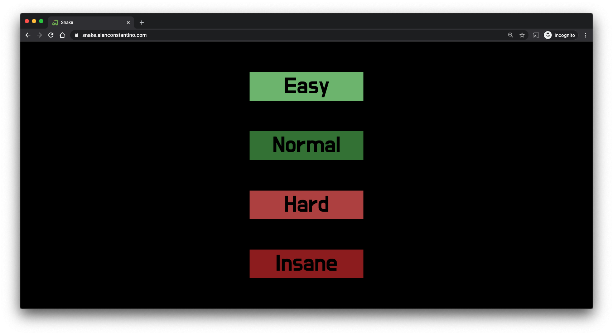
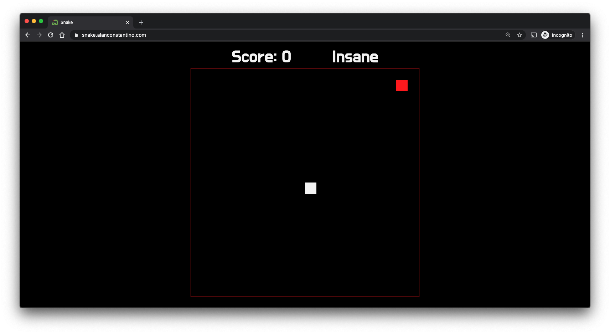

# [snake](https://snake.alanjc.com)
A snake game made with JavaScript. This game only works on desktop browsers and not mobile.

You can go [here](https://snake.alanjc.com) to play the game.

# Images

# Things to do
- Refactor main.js code.
- Don't allow a player to go backwards (i.e. if they're going up, don't allow them to go down).
- When you press any movement key before you select a difficulty, and then select a difficulty, the snake will move in that direction.
  - Also when you press and hold a direction, then die and select a difficutly, you will also move in that direction when you restart the game.
- Make game work on Internet Explorer.
- Make the game responsive (allow it to work on mobile devices).